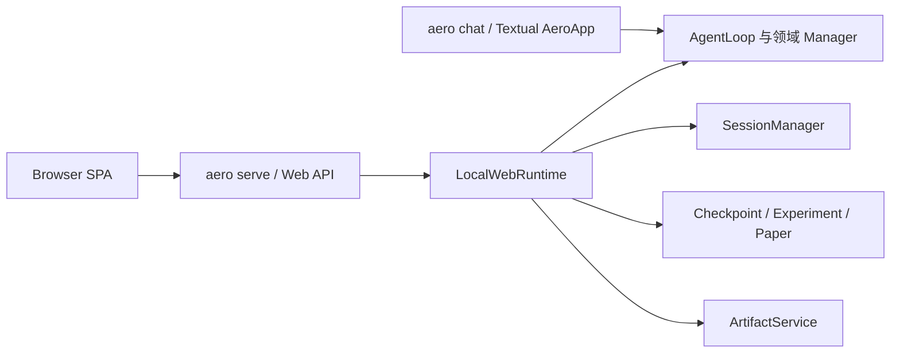

# Aerolytica 本地 Web UI 开发评估与实施计划

## 文档信息

- 状态：提案
- 日期：2026-07-26
- 目标版本：待排期
- 适用范围：用户在本机项目目录中启动仅监听 localhost 的 Web 服务，通过现代网页 UI 使用 Aerolytica

## 1. 结论摘要

Aerolytica 增加本地 Web UI 不需要重写 Agent、气象工具或领域数据层，整体属于中等规模改造。

现有 `AgentLoop` 已经是基本脱离 Textual 的异步流式核心，工具执行过程能够输出文本、状态、确认请求和完成事件；105 个已注册 Agent 工具、会话存储、检查点、实验和论文版本管理也都有可复用的独立模块。

主要工作包括：

1. 新增 `aero serve` 本地启动入口和 HTTP 服务。
2. 新增无 UI 的 Web 会话运行层，负责 Agent 生命周期、流式事件、确认、取消、自动保存和上下文桥接。
3. 开发现代化网页客户端。
4. 整理少量进程级全局状态，保证多个会话、浏览器标签页和后台 Agent 不会互相污染。
5. 为图片、PDF、报告和其他本地产物提供安全的浏览器预览与下载能力。

现有 `aero chat` 可以继续保留，Web Server 不应实例化或依赖 Textual 的 `AeroApp`。

按单人开发估算：

- 可用的本地 Web 对话版本：约 5–8 人日。
- 包含会话、配置、实验、检查点、论文版本、后台 Agent 和产物预览的完整版本：约 13–20 人日，即约 2–4 周。
- 视觉设计、响应式适配和交互打磨程度会影响最终工期。

## 2. 产品目标

### 2.1 核心目标

- 用户可在已初始化的 Aerolytica 项目目录中运行：

  ```bash
  aero serve
  ```

- 服务默认只监听 `127.0.0.1`，启动后自动打开系统浏览器。
- 用户可以通过网页完成当前 TUI 中的主要科研工作流。
- Web UI 使用现代聊天产品的布局和交互，不要求用户记忆 Slash command。
- Web 和 TUI 共用 Agent、工具、项目文件、配置、会话和领域 Manager。
- 新增 Web 功能不得破坏 `aero chat` 的行为和测试。

### 2.2 功能等价而非交互等价

Web UI 应提供与 TUI 等价的能力，但不必逐字复刻终端交互：

| TUI 交互 | Web UI 形式 |
|---|---|
| `/session`、`/new` | 会话侧边栏、新建会话按钮 |
| `/model`、`/provider`、`/variants` | 模型设置面板 |
| `/vision`、`/websearch` | 能力配置面板 |
| `/mode` | 输入区模式切换器 |
| `/checkpoint`、`/restore` | 检查点列表、差异和恢复对话框 |
| `/experiment`、`/experiments` | 实验工作区面板 |
| `/paper` | 论文版本与导出面板 |
| `/subagent` | 后台任务面板 |
| `/compact` | 会话菜单中的“压缩上下文” |
| `/copy` | 消息复制按钮 |
| `/preview` | 浏览器内图片或 PDF 预览 |
| `/theme` | 网页主题设置 |

Slash command 可以继续兼容，但不应成为 Web UI 的主要操作方式。

## 3. 非目标

首个 Web 版本明确不包含：

- 公网部署。
- 多用户注册、登录和租户系统。
- 多台服务器或分布式运行。
- 远程任务队列。
- 用户级容器、沙箱和资源配额。
- 一个 Server 进程同时管理多个项目目录。
- 替换或移除 Textual TUI。

每次执行 `aero serve` 只服务启动命令所在的一个项目目录。

## 4. 当前架构评估

### 4.1 可直接复用的部分

#### Agent 核心

`src/aero/agent/loop.py` 中的 `AgentLoop` 自行管理：

- LLM 客户端。
- 对话消息。
- 工具注册表。
- 工具轮次。
- 取消状态。
- 危险操作确认 Future。
- Token 用量。

`run_stream()` 已产生以下事件：

- `text`
- `status`
- `confirm`
- `content_blocked`
- `done`

这些事件可以直接映射为 Web 的流式事件协议。

#### 工具系统

`src/aero/toolbox/registry.py` 与 `src/aero/toolbox/builtin_tools.py` 已独立于 UI。当前共注册 105 个工具，覆盖数据检索和下载、文件处理、科学运行时、文献、图像、计划、备忘录、论文、检查点和后台任务等能力。

Web Server 启动时需要显式导入内置工具聚合模块，不能依赖 TUI 的导入副作用。

#### 领域 Manager

以下模块可以直接由无 UI 的应用层调用：

- `src/aero/agent/session.py`
- `src/aero/checkpoints.py`
- `src/aero/experiments.py`
- `src/aero/paper_versions.py`
- `src/aero/paper_export.py`

#### UI 上下文桥

项目已经使用 `ContextVar` 将工具运行和客户端交互解耦：

- `src/aero/toolbox/paths.py`：项目和实验工作区。
- `src/aero/agent/progress.py`：工具进度。
- `src/aero/toolbox/secret_input.py`：安全凭据输入。
- `src/aero/agent/checkpoint_context.py`：对话检查点。
- `src/aero/agent/subagent.py`：后台 Agent 启动、查询和取消。

Web 会话运行层可以为这些桥注入 Web 实现。

### 4.2 当前主要耦合

`src/aero/cli/main.py` 约 8,100 行，`AeroApp` 同时负责：

- Textual 控件和主题。
- 用户输入及 Slash command 路由。
- Agent 初始化和运行。
- 流式事件消费。
- 会话自动保存和标题生成。
- 配置向导。
- 危险操作确认。
- 凭据输入。
- 实验、检查点和论文版本流程。
- 后台 Agent 生命周期。
- 图片和 PDF 预览。

Web Server 不应导入或调用这些 Widget handler。需要复用的不是 Textual 类，而是它们背后的领域 Manager 和少量应用编排逻辑。

### 4.3 当前 Server 状态

`src/aero/server/` 目前只有空的 `__init__.py`，可作为新 Server 模块的起点。

项目尚未直接声明 Web Server 框架依赖。实现时应将选定的 ASGI Server、路由框架和上传支持声明为直接依赖或 `web` 可选依赖，不应依赖其他包偶然带入的传递依赖。

## 5. 目标架构



TUI 和 Web 共用底层核心，但拥有各自的客户端适配器。首版不强制让 TUI 改为调用 `LocalWebRuntime`，从而降低回归风险；稳定后可以逐步将纯应用逻辑提取为双方共享服务。

### 5.1 推荐模块划分

名称可在实现时调整，职责应保持清晰：

```text
src/aero/
├── application/
│   ├── events.py             # 对外事件模型
│   ├── local_session.py      # 单个对话会话和 Agent 生命周期
│   ├── run_coordinator.py    # run、确认、取消、事件缓存
│   ├── session_service.py    # 新建、保存、加载、重命名和压缩
│   └── artifact_service.py   # 项目产物安全解析和元数据
└── server/
    ├── app.py                # ASGI app factory
    ├── cli.py                # aero serve 启动参数
    ├── dependencies.py       # 项目目录和 LocalWebRuntime
    ├── routes/
    │   ├── chat.py
    │   ├── sessions.py
    │   ├── settings.py
    │   ├── artifacts.py
    │   ├── checkpoints.py
    │   ├── experiments.py
    │   └── paper.py
    └── static/               # 编译后的网页资源
```

### 5.2 `LocalWebRuntime`

Server 进程中只创建一个 `LocalWebRuntime`，绑定启动时的项目目录。它负责：

- 加载项目配置和用户级凭据。
- 显式注册内置工具。
- 按会话 ID 管理 `LocalSession`。
- 管理正在运行的任务和事件队列。
- 在服务关闭时取消任务并关闭所有 LLM 客户端。
- 为项目级写操作提供进程内锁。

### 5.3 `LocalSession`

每个活动会话拥有：

- 一个 `AgentLoop`。
- 一个 `asyncio.Lock`，保证同一会话不会并行执行两轮消息。
- 会话 ID、当前模式和工作区。
- 当前 run 和取消句柄。
- 危险操作确认状态。
- 临时凭据句柄。
- `SubAgentManager`。
- 最近事件缓存，支持页面刷新后恢复状态。

不同会话可以并行运行；同一会话的消息必须排队或明确拒绝并行提交。

## 6. Web 通信协议

推荐使用 REST 处理命令，使用 SSE 传输 Server 到浏览器的流式事件。确认、取消和凭据提交通过 REST 回传。若前端最终选择 WebSocket，也应保持相同的事件模型。

### 6.1 会话 API

```text
GET    /api/sessions
POST   /api/sessions
GET    /api/sessions/{session_id}
PATCH  /api/sessions/{session_id}
DELETE /api/sessions/{session_id}
POST   /api/sessions/{session_id}/load
POST   /api/sessions/{session_id}/compact
```

### 6.2 对话运行 API

```text
POST   /api/sessions/{session_id}/runs
GET    /api/runs/{run_id}/events
POST   /api/runs/{run_id}/confirm
POST   /api/runs/{run_id}/secret
DELETE /api/runs/{run_id}
GET    /api/runs/{run_id}
```

`POST /runs` 返回 `run_id`。浏览器随后连接事件流。

建议对外事件统一为结构化 JSON：

```json
{
  "id": 42,
  "run_id": "run_xxx",
  "type": "text_delta",
  "data": {
    "text": "正在检查数据..."
  }
}
```

事件类型至少包括：

- `run_started`
- `text_delta`
- `status`
- `confirmation_required`
- `secret_input_required`
- `artifact`
- `content_blocked`
- `error`
- `run_cancelled`
- `run_completed`

事件应带有单调递增 ID，以便 SSE 使用 `Last-Event-ID` 恢复连接。

### 6.3 领域 API

实验、检查点、论文和设置使用普通 REST：

```text
GET/POST/PATCH/DELETE /api/checkpoints/...
GET/POST/PATCH/DELETE /api/experiments/...
GET/POST                  /api/paper/...
GET/PATCH                 /api/settings
GET/POST                  /api/subagents/...
```

所有破坏性操作都必须沿用现有确认语义，不得因为调用来自 localhost 就自动批准。

## 7. Artifact、上传与预览

### 7.1 Artifact 路由

Web UI 不能使用 `file://`，也不能把任意绝对路径暴露给浏览器。建议使用：

```text
GET /api/artifacts/{artifact_id}
GET /api/artifacts/{artifact_id}/metadata
```

`artifact_id` 映射到 Server 端验证过的项目内文件。每次读取都必须：

1. 解析真实路径。
2. 检查路径位于项目目录或当前实验工作区。
3. 拒绝符号链接逃逸和路径穿越。
4. 设置正确的 `Content-Type` 和下载文件名。
5. 禁止访问密钥、环境文件和 `.aero` 内部敏感文件。

### 7.2 浏览器预览

- PNG、JPEG、WebP、GIF：消息内或侧边预览。
- PDF：浏览器内嵌查看或打开同源新标签页。
- Markdown、文本和代码：只读查看器。
- NetCDF、GRIB 和其他大型数据：显示元数据和下载操作，不直接加载整个文件。

现有调用系统 `open` 或 `xdg-open` 的预览工具在 TUI 中继续保留。Web 侧应将相同用户意图映射为 Artifact URL，而不是打开 Server 主机上的桌面程序。

### 7.3 文件上传

上传文件必须保存到当前项目或实验工作区的受控目录，并限制：

- 单文件大小。
- 允许的文件类型或明确的二进制处理策略。
- 重名行为。
- 路径字符和目录穿越。

上传完成后返回项目相对路径，并将该路径加入发送给 Agent 的消息上下文。

## 8. 配置与凭据

本地单用户模式可以继续使用：

- 项目配置：`aero.yaml`
- 用户凭据：`~/.aero/secrets.yaml`
- 加密会话：`~/.aero/sessions`

Web UI 的配置面板不得读取或返回完整密钥。API 只返回：

- 是否已配置。
- 服务商、模型和 Endpoint。
- 脱敏后的密钥摘要。

新密钥通过独立密码输入框提交，不进入聊天文本、Agent 消息、事件流或日志。现有一次性 `secret_handle` 机制应继续使用。

## 9. 启动入口

建议支持：

```bash
aero serve
aero serve --port 8765
aero serve --no-open
```

默认行为：

- Host 固定为 `127.0.0.1`。
- Port 使用固定默认值；被占用时给出清晰错误或选择空闲端口。
- 启动成功后自动打开浏览器。
- 输出当前项目路径、访问 URL 和停止方式。
- 收到 SIGINT/SIGTERM 时优雅关闭 Agent 和后台任务。

如果提供 `--host` 参数，首版只接受 loopback 地址，避免用户误将具有 Shell 和文件能力的服务暴露到局域网或公网。

## 10. 必须完成的状态整理

即使只有一个本机用户，多个标签页和后台 Agent 也可能并行。首版至少应处理：

### 10.1 计划 Session ID

`src/aero/data/plans.py` 的 `_current_session_id` 是进程全局变量。应改为：

- `ContextVar`；或
- 所有计划函数显式接收 `session_id`。

### 10.2 已读文件集合

`src/aero/toolbox/file_access.py` 的 `READ_FILES` 是进程全局集合。应变成每个 Agent/会话独立的上下文状态，避免一个会话读取文件后，另一个会话继承编辑许可。

### 10.3 视觉用量

`src/aero/toolbox/tools/vision.py` 的 `_vision_usage` 是全局单槽。应改为：

- 将用量随工具结果返回；或
- 使用每次 run 独立的 `ContextVar`。

### 10.4 工具轮次

`src/aero/toolbox/tools/tool_rounds.py` 的运行时轮次设置应更新当前 `AgentLoop` 或当前会话配置，不应作为进程全局值影响其他会话。

### 10.5 会话与项目状态写入

对以下读改写操作增加进程内锁和原子写：

- Session 索引。
- 项目配置和用户凭据。
- 实验活动状态。
- 检查点状态。
- 备忘录状态。

本地单进程版本不需要引入数据库，`asyncio.Lock`、线程锁和临时文件原子替换即可。

### 10.6 同步工具阻塞

部分同步工具可能阻塞 ASGI 事件循环。`Runtime.execute()` 应将同步函数放入线程池；明显 CPU 密集的工作可后续迁移到进程池。首版至少保证一个较慢的同步文件操作不会阻塞所有浏览器事件流。

## 11. TUI 兼容策略

### 11.1 基本原则

- `aero chat` 的入口和默认行为不变。
- `aero.server` 不导入 `aero.cli.main`。
- TUI 不依赖 HTTP Server。
- Agent、工具和 Manager 的公共接口尽量保持兼容。
- 全局状态改为 `ContextVar` 时提供与当前调用方式兼容的默认行为。

### 11.2 分步共享

首版 Web 可以直接使用 Agent 和领域 Manager，不要求先重构整个 `AeroApp`。

当 Web 功能稳定后，再逐步提取以下纯应用逻辑供两端共享：

- 会话标题和自动保存。
- 上下文压缩。
- 确认信息格式化。
- 检查点创建和恢复编排。
- 实验完成报告。
- 后台 Agent 结果合并。

每次提取前先增加行为测试，确保 TUI 输出和状态迁移保持一致。

## 12. 前端体验建议

### 12.1 页面布局

建议采用三块可伸缩布局：

- 左侧：会话、实验和新建入口。
- 中间：聊天消息、输入框和模式切换。
- 右侧：工具进度、后台任务和产物；在窄屏下变成抽屉。

### 12.2 聊天区域

- 流式 Markdown。
- 代码块复制。
- 表格、链接和数学公式。
- 图片内嵌预览。
- 每条消息的复制和重试操作。
- 工具状态默认折叠，可查看完整进度。
- 确认请求以内联卡片展示，不使用浏览器原生 `confirm()`。

### 12.3 运行状态

- 清楚区分“模型思考”“工具执行”“等待确认”“已完成”和“已取消”。
- 页面刷新后能够恢复当前 run 的最新状态。
- 用户可取消当前 run。
- 后台任务完成后在侧边栏和主会话中显示通知。

### 12.4 前端构建

可以采用团队熟悉的 TypeScript SPA 技术栈。编译产物应打包进 Python wheel，终端用户运行 `aero serve` 时不需要安装 Node.js。

若希望先降低工程复杂度，也可以先使用轻量静态前端完成协议验证，再在 API 稳定后替换为正式 SPA。

## 13. 分阶段实施计划

### P0：边界加固与协议设计

预计：1–2 人日。

任务：

- 定义 Web 事件模型。
- 增加 `LocalSession` 和会话级运行锁。
- 将计划 Session ID、已读文件集合和视觉用量改为会话上下文。
- 为 Session 索引和项目状态写入增加锁。
- 增加双会话隔离测试。
- 明确前端技术栈和构建产物目录。

完成标准：

- 两个测试会话并行运行时，消息、计划、文件权限和视觉用量不串线。
- 现有 TUI 核心测试继续通过。

### P1：本地 Server 与流式聊天

预计：3–4 人日。

任务：

- 增加 `aero serve`。
- 创建 ASGI app factory。
- 实现会话创建、加载和保存。
- 实现 run 创建、SSE 事件流、确认和取消。
- 接入 `use_workspace`、凭据、检查点和子 Agent 上下文桥。
- 实现优雅关闭。
- 增加 ASGI 集成测试。

完成标准：

- 浏览器可以创建或恢复会话。
- 文本和工具状态实时显示。
- 危险操作可以允许、始终允许或拒绝。
- 当前任务可以取消。
- Agent 全部已注册工具可正常调用。

### P2：现代聊天 UI 与 Artifact

预计：4–6 人日。

任务：

- 会话侧边栏和聊天主界面。
- Markdown、代码块、图片和状态面板。
- 确认卡片和错误状态。
- Artifact 安全路由。
- 图片、PDF、文本预览。
- 文件上传和产物下载。
- 设置面板基础框架。
- 页面刷新和 SSE 重连。

完成标准：

- 主要对话流程无需使用 Slash command。
- 生成图片和 PDF 可直接在浏览器查看。
- 页面刷新不会丢失已保存会话或正在等待确认的状态。
- 路径穿越和项目外文件访问被拒绝。

### P3：完整功能对齐

预计：4–6 人日。

任务：

- 模型、服务商、推理强度、视觉和联网搜索配置。
- 安全凭据输入。
- 会话重命名、删除和上下文压缩。
- 检查点列表、差异、创建、删除和恢复。
- 实验创建、切换、完成和删除。
- 论文版本、差异、恢复和导出。
- 后台 Agent 列表、进度、确认和取消。
- 备忘录、项目指令和下载记录的辅助视图。

完成标准：

- README 中当前列出的核心功能都能从 Web UI 使用。
- 破坏性操作均需要确认。
- API 不返回原始密钥。
- TUI 和 Web 对相同领域操作产生一致结果。

### P4：质量、打包与交付

预计：1–2 人日。

任务：

- 完整回归测试。
- 浏览器端端到端测试。
- 空项目、未配置模型和异常退出流程。
- Wheel 中静态资源打包验证。
- 安装脚本与可选依赖调整。
- README 和安装文档更新。
- 性能和大文件响应检查。

完成标准：

- 从全新安装运行 `aero serve` 可直接打开 Web UI。
- `aero chat` 行为和测试保持不变。
- Server 只监听 loopback。
- Ctrl+C 可以完整释放端口、任务和 HTTP 客户端。

## 14. 测试计划

### 14.1 单元测试

- Web 事件序列化。
- Run 状态机。
- 确认和取消状态。
- 每会话 Agent 与锁。
- Session ID、工作区和文件权限隔离。
- Artifact 路径安全。
- 配置脱敏。
- Session 索引并发保存。

### 14.2 Server 集成测试

- 创建会话并提交消息。
- 接收完整 SSE 事件序列。
- 确认后继续执行工具。
- 拒绝后 Agent 正确收到拒绝结果。
- 取消长任务。
- SSE 断线重连。
- 页面刷新后恢复会话。
- 上传文件并供 Agent 使用。
- 下载和预览项目内产物。
- 拒绝路径穿越、绝对路径和符号链接逃逸。

### 14.3 TUI 回归

- 运行现有测试套件。
- 重点覆盖：
  - Agent 流式事件。
  - 危险操作确认。
  - Session 保存和恢复。
  - 项目工作区。
  - 子 Agent。
  - 视觉工具。
  - 检查点和实验。

本次评估期间执行的核心回归测试共 114 项，全部通过。

### 14.4 前端端到端测试

- 首次启动和模型未配置状态。
- 新建、切换和删除会话。
- 流式文本和工具进度。
- 确认、拒绝和取消。
- 图片、PDF 和代码预览。
- 设置修改和密钥提交。
- 检查点恢复。
- 实验切换。
- 后台任务完成通知。

## 15. 风险与缓解措施

| 风险 | 影响 | 缓解措施 |
|---|---|---|
| Web 复制 TUI 编排逻辑 | 两端行为逐渐分叉 | 优先调用独立 Manager；稳定后逐步提取纯应用服务 |
| 同一会话并行消息 | Agent 上下文损坏 | 每会话 `asyncio.Lock`，前端显示排队或禁用发送 |
| 全局状态串会话 | 文件权限、计划和用量错配 | 改为 `ContextVar` 或显式参数 |
| 同步工具阻塞事件循环 | 所有浏览器流暂停 | 同步工具进入线程池，限制并发 |
| SSE 断线 | UI 看起来卡死 | 事件 ID、短期事件缓存和重连 |
| 本地文件被越权读取 | 泄露项目外文件 | 真实路径校验、Artifact ID、敏感文件黑名单 |
| localhost 被恶意网页调用 | 未授权本地操作 | 同源检查、禁用 CORS、启动随机令牌或会话 Cookie |
| 凭据进入日志或消息 | 密钥泄露 | 独立密码接口、一次性 handle、统一脱敏 |
| TUI 回归 | 现有用户受影响 | Server 不依赖 TUI，接口兼容，持续运行现有测试 |
| 前端构建增加发布复杂度 | 安装包不完整 | CI 构建静态资源并验证 Wheel 内容 |

## 16. 验收标准

项目达到完整本地 Web 版交付标准时，应满足：

1. `aero serve` 在当前项目启动 localhost 服务并打开浏览器。
2. `aero chat` 保持可用且现有回归测试通过。
3. Web 可以新建、保存、恢复、重命名和删除会话。
4. Agent 回复、工具状态和错误实时展示。
5. 全部已注册 Agent 工具可以从 Web 对话中执行。
6. 危险操作、执行模式切换和敏感配置均保留确认流程。
7. 用户可以取消当前任务并查看后台任务。
8. 图片、PDF、报告和代码产物可在浏览器安全预览或下载。
9. 模型、视觉和联网搜索能够在设置面板中配置。
10. 检查点、实验和论文版本功能可通过图形界面使用。
11. 多个会话或标签页不会串消息、计划、文件许可和用量。
12. Server 不监听非 loopback 地址，不允许访问项目目录外文件。
13. API、事件流、日志和 Session 中不出现原始密钥。
14. 服务退出后端口、子进程、后台任务和 HTTP 客户端均被释放。

## 17. 推荐实施顺序

推荐先完成事件协议和 `LocalSession`，再制作正式 UI。顺序如下：

1. 状态隔离与会话运行层。
2. Server 和协议测试。
3. 最小前端验证完整对话、确认和取消链路。
4. Artifact 与上传。
5. 正式现代化 UI。
6. 实验、检查点、论文和后台任务面板。
7. 打包、文档和完整回归。

不建议先重构整个 `AeroApp`，也不建议让 Web 调用 Textual Widget 方法。以独立 Web 适配器接入现有核心，可以用最小风险实现目标，并为以后逐步共享应用逻辑保留空间。
